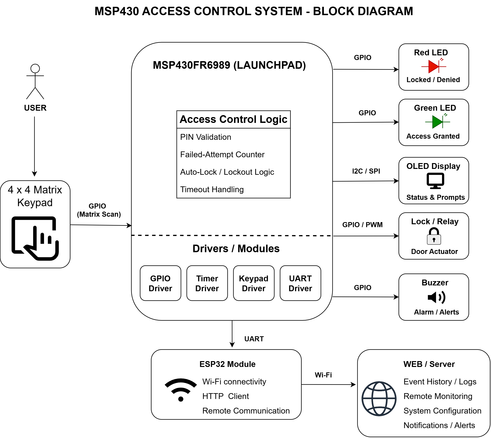

# MSP430 Access Control System

A bare-metal access-control system built on the MSP430FR6989 LaunchPad. The project uses a finite-state-machine architecture to authenticate users and control access while demonstrating fundamental embedded-systems concepts such as GPIO, interrupts, timers, hardware abstraction, and driver development.

---

## System Architecture



The MSP430 Access Control System uses a finite-state-machine architecture to authenticate users and control access. Hardware peripherals are abstracted through dedicated drivers, while an optional ESP32 communication module provides Wi-Fi connectivity and remote monitoring capabilities.

---

## Features

- Finite-state machine architecture
- GPIO driver
- Timer driver
- Interrupt-driven input handling
- Software debouncing
- Status LEDs
- Keypad authentication (in progress)
- UART event logging (planned)
- LCD interface (planned)

---

## Current Status

Completed:

- GPIO driver
- Interrupt handling
- Timer-based debouncing
- Access-control state machine

In Progress:

- Keypad integration

Planned:

- UART logging
- LCD support
- Wi-Fi module integration

---

## Hardware

### Current Prototype

- MSP430FR6989 LaunchPad
- On-board red LED (P1.0)
- On-board pushbutton (S1)

### Planned Hardware

- 4×4 matrix keypad
- LCD display
- Green status LED
- Buzzer
- Electronic lock
- Optional ESP32 communication module

---

## State Machine

```text
LOCKED
   
    -Correct PIN : UNLOCKED
   
    -Three failures : ALARM

UNLOCKED
   
    -Timeout : LOCKED

ALARM
   
    -Timeout / Reset : LOCKED
```

---

## Concepts Demonstrated

- Embedded C
- Register-level programming
- GPIO configuration
- Interrupt service routines (ISRs)
- Timer peripherals
- Software debouncing
- Finite-state machines
- Hardware abstraction layers (HAL)

---

## Future Enhancements

- Keypad authentication
- LCD status display
- UART event logging
- Wi-Fi connectivity using an ESP32 coprocessor
- Web dashboard
- Custom PCB

## Demonstrations

The following demonstrations will be added as development progresses:

- GPIO interrupt handling
- Timer-based debouncing
- Keypad authentication
- Alarm-state transitions